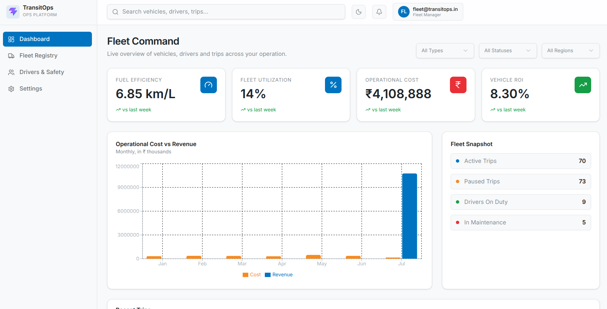
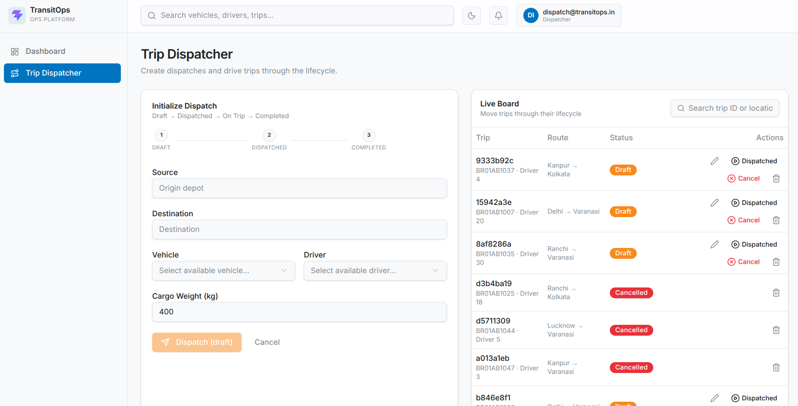

#  TransitOps - Smart Transportation Operation Platform

##  Project Overview

**TransitOps** is a comprehensive, modern fleet and transportation management platform designed to streamline operations, tracking, and analytics for transit companies. It provides a centralized dashboard to manage everything from vehicle maintenance and driver safety to real-time trip dispatching and financial reporting. 

Built with enterprise scalability in mind, it features a strict **Role-Based Access Control (RBAC)** system ensuring different departments (Fleet Managers, Dispatchers, Safety Officers, and Financial Analysts) only interact with the data relevant to their workflows.

##  Live Demo
**Production URL:** [https://frontend-ten-sage-48.vercel.app](https://frontend-ten-sage-48.vercel.app)

##  GitHub Repository
**GitHub Link:** [https://github.com/divyanshuraj751/TransitOps_Smart_Transprtation_Operation_Platform](https://github.com/divyanshuraj751/TransitOps_Smart_Transprtation_Operation_Platform)

##  Features

- **Strict Role-Based Access (RBAC)**: Secure authentication allowing varied access for Fleet Managers, Dispatchers, Safety Officers, and Financial Analysts.
- **Fleet Registry & Health**: Complete vehicle tracking, managing odometer readings, capacity constraints, acquisition costs, and real-time operational status (Available, On Trip, In Shop, Retired).
- **Driver Management**: Comprehensive driver profiles tracking license validity, contact details, and automated safety scores to ensure compliance.
- **Smart Trip Dispatching**: Assign available vehicles and drivers to routes while automatically validating cargo weight against vehicle capacity.
- **Maintenance & Fuel Tracking**: Keep an active log of vehicle service history, oil changes, and fuel expenses to maintain a healthy fleet.
- **Financial Analytics**: High-level visual charts displaying vehicle ROI, fuel efficiency trends, and overall cost breakdowns.

##  Tech Stack

**Frontend Framework & UI:**
- React 18
- TypeScript
- Vite
- Tailwind CSS v4 & custom CSS variables
- shadcn/ui & Radix UI (Accessible components)
- Lucide React (Icons)
- Recharts (Data Visualization)

**Routing & State Management:**
- TanStack Router (Type-safe routing)
- Context API (Auth state)

**Backend & Database:**
- Supabase (PostgreSQL)

##  Screenshots

### Dashboard


### Dispatch View


### Analytics


## ⚙️ Environment Variables

To run this project locally, you will need to add the following environment variables to your `.env` file in the `frontend` directory:

```env
VITE_SUPABASE_URL=your_supabase_project_url
VITE_SUPABASE_ANON_KEY=your_supabase_anon_key
```

##  Setup Instructions

1. **Clone the repository:**
   ```bash
   git clone https://github.com/divyanshuraj751/TransitOps_Smart_Transprtation_Operation_Platform.git
   cd TransitOps_Smart_Transprtation_Operation_Platform/frontend
   ```

2. **Install dependencies:**
   ```bash
   npm install
   ```

3. **Set up Environment Variables:**
   Create a `.env` file in the `frontend` directory and add your Supabase credentials (see [Environment Variables](#%EF%B8%8F-environment-variables)).

4. **(Optional) Seed the Database:**
   If you have a fresh Supabase database and need to seed it with mock data, you can run the provided seeding script:
   ```bash
   npx tsx scripts/seed.ts
   ```

5. **Start the development server:**
   ```bash
   npm run dev
   ```

6. **Access the application:**
   Open your browser to [http://localhost:5173](http://localhost:5173). 
